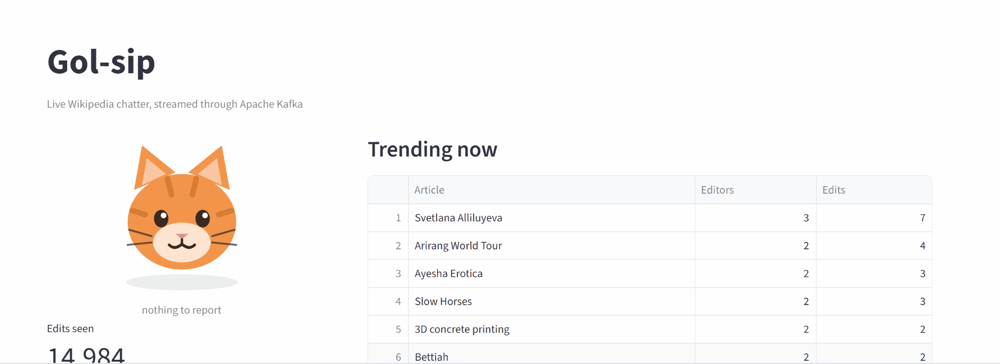

# Gol-sip

**Live internet chatter, streamed through Apache Kafka.**

Every time someone edits Wikipedia — in any language, anywhere in the world — an event
appears on a public firehose within a second or two. Gol-sip pipes that firehose through
Kafka, works out which articles are drawing a crowd right now, and puts it on a live
dashboard. When edits suddenly spike, a cartoon cat gasps.



Roughly 500 edits a minute flow through it, about 40% of them made by bots.

---

## Architecture

```
Wikimedia EventStreams (SSE)
            │
            ▼
    wiki_producer.py ──────► gossip.wiki.edits ─┬──► printer.py
                                                │
                                                ├──► trend_detector.py ──► gossip.trending ─┐
                                                │                                           │
                                                └──► stats.py ───────────► gossip.alerts ───┤
                                                                                            ▼
                                                                                    dashboard/app.py
```

Producers only write. Consumers only read. Neither knows the other exists — which is the
entire point. I can restart the dashboard, add a third consumer, or take the producer down
for lunch, and nothing else notices.

### Topics

| Topic | Contents |
|---|---|
| `gossip.wiki.edits` | Every edit, unfiltered — the raw firehose |
| `gossip.trending` | Top-10 leaderboard snapshots, published every 30s |
| `gossip.alerts` | Spike alerts, which make the cat gasp |

---

## The decisions that actually mattered

**Produce raw, filter on the way out.** The producer writes every edit from every wiki,
including bots and housekeeping pages, and each consumer decides what it cares about.
Filtering at the producer would have been less code — and would have permanently thrown
away data I turned out to need twice.

**Partition by page title.** The message key is the article title, so every edit to the
same page lands in the same partition and stays in order, while the load still spreads
evenly across partitions (247 / 230 / 248 in an early test).

**Separate consumer groups.** `printer`, `stats` and `trend_detector` each have their own
`group.id`, so all three receive a complete copy of the stream instead of competing for it.
Same topic, three independent readers, no coordination.

**Rank by unique editors, not edit count.** My first trending list was topped by
`Q139676717` and `File:Alex Wilson 4 Australia.JPG` — Wikidata records and Commons uploads,
edited in bulk by people running batch tools. None were flagged as bots, so a bot filter
missed them entirely, and raising the threshold would only have promoted bigger batches.
Counting *distinct editors* fixed it: one person making 16 edits is one person's interest,
while 16 different people on one page is news. The list turned into real articles
immediately.

---

## Things that broke, and why

**Wikipedia killed my producer every few minutes.** `Response ended prematurely` — Wikimedia
restarts its stream servers regularly and no client keeps a connection forever. The producer
now reconnects and resumes using the SSE `Last-Event-ID` header, which is the same idea as a
Kafka offset: a bookmark that survives disconnection. The same problem, solved twice at two
different layers.

**A topic remembers everything, including your mistakes.** I changed the shape of the
trending messages mid-project, and the dashboard crashed with `KeyError: 'top'` — because
`gossip.trending` still held hundreds of messages in the old format. Kafka doesn't clean
that up; a log is a log. Consumers have to tolerate what's already written.

**Unicode.** Windows terminals default to cp1252, which cannot print `Милкрик (Юта)`. Kafka
was fine the whole time — every message is UTF-8 — but printing crashed the producer.

---

## Built with

| Layer | What |
|---|---|
| Language | Python 3.13 |
| Broker | Apache Kafka 4.1 in KRaft mode — no ZooKeeper, single broker, 3 partitions per topic |
| Kafka client | `confluent-kafka` (Python bindings over librdkafka) |
| Ingestion | `requests` against Wikimedia EventStreams (Server-Sent Events) |
| Dashboard | Streamlit, with pandas for the edits-per-minute chart |
| Infrastructure | Docker Compose |

---

## Running it locally

Requires Docker Desktop and Python 3.

```bash
python -m venv .venv
.venv\Scripts\Activate.ps1
pip install -r requirements.txt

docker compose up -d          # starts Kafka 4.1 in KRaft mode, no ZooKeeper
python test_kafka.py          # sanity check: should print Sent! and Received:
```

Then four terminals:

```bash
python producers\wiki_producer.py       # Wikipedia -> Kafka
python consumers\trend_detector.py      # trending leaderboard
python consumers\stats.py               # rates, bot split, spike alerts
streamlit run dashboard\app.py          # dashboard at localhost:8501
```

The trending table fills after 30 seconds. The cat stays calm for the first 5 minutes —
`stats.py` needs that much history before "unusual" means anything.

---

## Roadmap

- [ ] **Failure experiments** — stop a consumer and watch it catch up; run two consumers in
      one group and see the partitions split; kill Kafka while the producer runs
- [ ] **Reddit as a second source** — Wikipedia pushes, Reddit must be polled; Kafka absorbs
      the difference
- [ ] **FastAPI + WebSockets + React** — needed for a public deployment, because the
      dashboard's fixed `group.id` means two simultaneous visitors would *split* the stream
      between them rather than each seeing all of it
- [ ] Spark or Airflow for windowed aggregation instead of hand-rolled sliding windows

---

Built as a learning project. The cat is drawn by hand in SVG.
